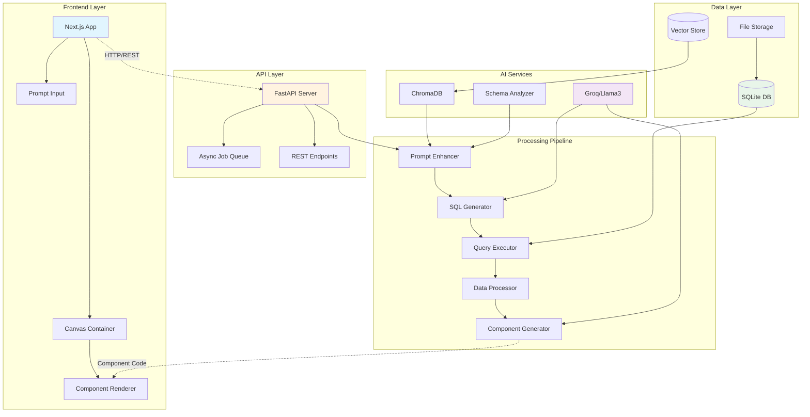
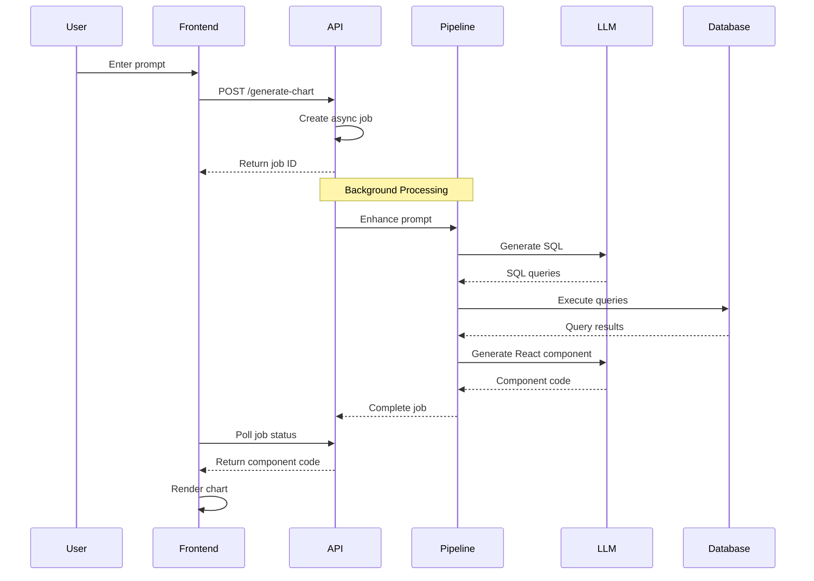

# AI Dashboard Prototype

An intelligent dashboard system that generates interactive data visualizations from natural language prompts using LLMs, SQL generation, and dynamic React components.

## 🏗️ System Architecture



### Data Flow Sequence



## 🚀 Quick Start

### Prerequisites

* Python 3.8+
* Node.js 16+
* GROQ API Key (get it from [console.groq.com](https://console.groq.com))

### Setup Instructions

```bash
# 1. Clone and enter directory
git clone <repository-url>
cd dad-prototype/prototype1
```

### Set up Environment Variables

1. Open the file `.env.example` and add your **GROQ API Key**:

   ```
   GROQ_API_KEY=your_groq_api_key_here
   ```
2. Rename `.env.example` to `.env`:

   ```bash
   mv .env.example .env   # macOS/Linux
   rename .env.example .env   # Windows (or manually rename in Explorer)
   ```
3. Leave `.env.local` as it is.

### Install Dependencies

```bash
# Backend dependencies
cd backend
pip install -r requirements.txt
cd ..

# Frontend dependencies
npm install
```

## Running the Application

You will need **two terminal windows/tabs**:

### Terminal 1 - Backend:

```bash
cd backend
python run_server.py
```

### Terminal 2 - Frontend:

```bash
npm run dev
```

## Access Points

* **Frontend**: [http://localhost:3000](http://localhost:3000)
* **Backend API**: [http://localhost:8000](http://localhost:8000)
* **API Documentation**: [http://localhost:8000/docs](http://localhost:8000/docs)

## 📊 Loading Data (Optional)

You can use the provided scripts to load or generate data after the backend is running:

```bash
# Load a CSV or Excel file
python load_data.py path/to/your/data.csv

# List all loaded tables
python load_data.py --list
```

Or generate test data:

```bash
python generate_test_data.py
```

## 💡 Usage

1. **Load your data** (CSV or Excel files) into the database
2. **Open the dashboard** at [http://localhost:3000](http://localhost:3000)
3. **Enter a natural language prompt** like:

   * "Show me sales by platform"
   * "Create a bar chart of top 10 games"
   * "Display monthly revenue trends"
4. **Watch as the system**:

   * Enhances your prompt with context
   * Generates SQL queries
   * Processes the data
   * Creates a custom React component
   * Renders an interactive chart

## 🔧 Key Technologies

### Frontend

* **Next.js 15** - React framework
* **React 19** - UI library
* **Recharts** - Charting library
* **Tailwind CSS** - Styling
* **TypeScript** - Type safety

### Backend

* **FastAPI** - Python web framework
* **SQLite** - Database for data storage
* **ChromaDB** - Vector database for context
* **Groq/Llama3** - LLM for code generation
* **Pandas** - Data processing

## 📁 Project Structure

```
prototype1/
├── backend/
│   ├── api/                 # FastAPI endpoints
│   ├── database/            # SQLite operations
│   ├── knowledge_base/      # ChromaDB context
│   ├── prompt_enhancement/  # Prompt processing
│   ├── query_generation/    # SQL generation
│   ├── chart_generation/    # Component generation
│   └── run_server.py        # Backend entry point
│
├── src/
│   ├── app/                 # Next.js app directory
│   ├── components/          # React components
│   │   ├── Canvas.tsx
│   │   ├── ComponentRenderer.tsx
│   │   └── PromptInput.tsx
│   └── services/            # API client services
│
├── load_data.py             # Data loading utility
├── generate_test_data.py    # Test data generator
└── README.md                # This file
```

## 🔍 How It Works

1. **User Input**: Natural language prompt entered in the UI
2. **Prompt Enhancement**: Enriched with database schema and ChromaDB context
3. **SQL Generation**: LLM generates appropriate SQL queries
4. **Query Execution**: Queries run against SQLite database
5. **Data Processing**: Results transformed for visualization
6. **Component Generation**: LLM creates custom React component code
7. **Dynamic Rendering**: Component rendered in real-time using Babel

## ⚠️ Known Limitations

* Requires data to be pre-loaded into SQLite
* LLM-generated components may occasionally have syntax errors
* Limited to Recharts visualization library
* No data upload UI (must use Python script)

## 🐛 Troubleshooting

### Backend won't start

* Check if port 8000 is already in use
* Verify GROQ\_API\_KEY is set correctly in `.env`
* Ensure Python dependencies are installed

### Frontend won't start

* Check if port 3000 is already in use
* Run `npm install` to ensure dependencies
* Clear `.next` folder and restart

### Charts not rendering / Blank container

* Verify data is loaded in the database
* Check browser console for errors
* Ensure backend is running and accessible
* Common issues:

  * LLM using backticks in JSON (fixed in latest version)
  * Platform names converted to NaN (fixed in data processor)
  * Component name not extracted properly (now uses regex extraction)

### "No data available" message

* Load data using: `python load_data.py your_file.csv`
* Or generate test data: `python generate_test_data.py`
* Check database status at [http://localhost:8000/api/v1/database-status](http://localhost:8000/api/v1/database-status)

### Component syntax errors

* The LLM sometimes generates invalid React code
* Check browser console for specific error
* Try rephrasing your prompt to be more specific
* The system will show an error component with details

## 🤝 Contributing

This is a prototype system. Feel free to experiment and extend:

* Add new visualization types
* Improve prompt understanding
* Enhance error handling
* Add data upload UI
* Support more chart libraries

## 📄 License

This is a prototype/proof-of-concept system for demonstration purposes.
