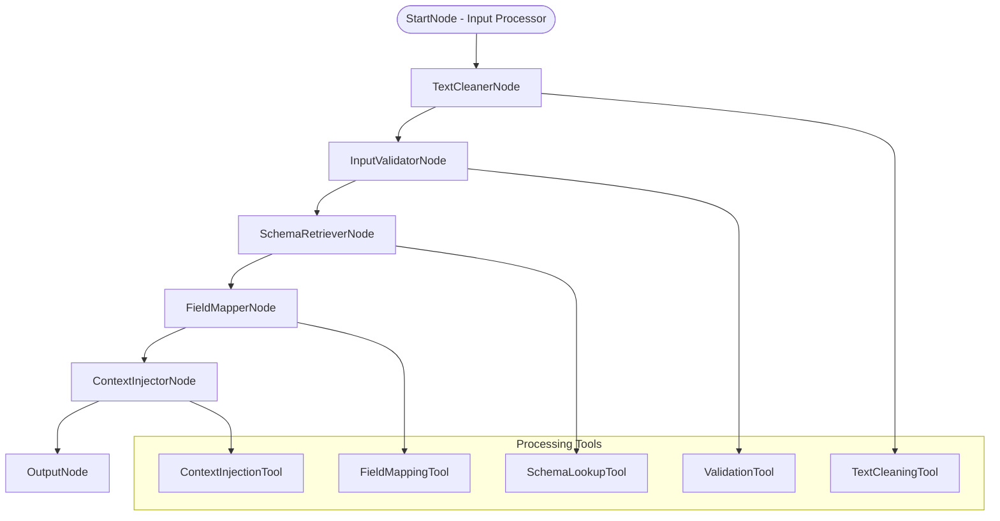

# Input Parser Agent

## 🌟 Problem Statement

Natural language user inputs in data visualization systems are often messy, ambiguous, and disconnected from actual database schemas. Users express requests using colloquial terms, contain typos, filler words, and lack precision needed for accurate data retrieval. Without proper parsing and schema grounding, downstream agents cannot reliably interpret user intent or generate meaningful visualizations.

This AI Agent will transform raw natural language input into clean, validated, and schema-enriched structured data, enabling precise interpretation and visualization generation.

---

## 💡 Agent Objective

* Clean and normalize raw user input by removing noise and filler words.
* Validate if user input contains actionable visualization intent.
* Map human terminology to actual database schema elements.
* Enrich parsed input with relevant database schema context.
* Produce structured output optimized for downstream Intent Resolver Agent.

---

## 📂 Scope of Agent

### ✅ The Agent DOES:

1. **Text Cleaning & Normalization** - Remove filler words and noise while preserving word order.
2. **Input Validation** - Detect actionable visualization intents with confidence scoring.
3. **Schema Retrieval** - Load relevant database table and column metadata using keyword matching.
4. **Field Mapping** - Map human terms to actual database field names with table.column format.
5. **AI-Enhanced Intent Detection** - Use Groq LLM for accurate intent classification and confidence.
6. **Context Integration** - Combine all processing stages into structured output.
7. **Database Integration** - SQLite support with schema caching and relationship mapping.
8. **Structured Output** - Specification-compliant JSON output for downstream agents.

### ❌ The Agent DOES NOT:

* Generate visualization suggestions or chart recommendations (Intent Resolver's job).
* Generate actual SQL queries or database operations.
* Create visualizations or charts directly.
* Perform complex data analysis or calculations.
* Handle user authentication or authorization.
* Modify database schemas or structures.
* Execute downstream visualization logic.
* Store persistent user data beyond session scope.

---

## ⚙️ LangGraph Architecture



### States

| State Name              | Purpose                                                    |
| ----------------------- | ---------------------------------------------------------- |
| `InputParserState`      | Unified state object containing all processing stages     |
| `raw_input`             | Original user input with session metadata                 |
| `cleaned_input`         | Processed input with noise removal and normalization      |
| `is_valid`              | Input validity status and confidence scores               |
| `detected_intent`       | AI-detected visualization intent (show_data/compare_data/trend_analysis) |
| `primary_table`         | Main database table identified for the query             |
| `columns`               | Array of relevant database columns extracted              |
| `mapped_fields`         | Field mappings between human terms and database fields    |
| `schema_context`        | Complete database schema information for relevant tables  |
| `confidence_score`      | LLM-provided confidence score (0.0-1.0)                  |

---

### Nodes

| Node Name                 | Functionality                                                          |
| ------------------------- | ---------------------------------------------------------------------- |
| **TextCleanerNode**       | Removes filler words, preserves word order, normalizes text           |
| **InputValidatorNode**    | Validates if input contains actionable visualization intent            |
| **SchemaRetrieverNode**   | Loads relevant database schema metadata using keyword matching        |
| **FieldMapperNode**       | Maps human terms to database field names using exact and fuzzy matching |
| **ContextInjectorNode**   | Integrates AI intent detection and builds final structured output     |

---

## 🛠️ Tools Required

| Tool Name               | Purpose                                                                    |
| ----------------------- | -------------------------------------------------------------------------- |
| **TextCleaner**         | NLP-based text preprocessing with word order preservation                 |
| **SchemaRetriever**     | Database schema retrieval with SQLite support and caching                 |
| **FieldMapper**         | String similarity matching for field name resolution                      |
| **InputValidator**      | Intent detection and input quality assessment                             |
| **ContextInjector**     | AI-enhanced intent detection using Groq LLM with confidence scoring       |

---

## 📊 Core Processing Functions

### Text Cleaning Pipeline

* **Filler Word Removal**: Strip "can you", "please", "maybe" while preserving word order
* **Noise Reduction**: Remove stop words like "a", "the", "and", "for"
* **Normalization**: Convert to lowercase, standardize spacing
* **Keyword Preservation**: Maintain intent keywords and business terms

### Schema Mapping Logic

* **Keyword Matching**: Direct keyword to table name matching with confidence scoring
* **Column Extraction**: Extract all relevant columns from matched tables
* **Relationship Building**: Map foreign key relationships between tables
* **Confidence Scoring**: Rate schema relevance for downstream validation

### Field Mapping Strategy

* **Exact Matching**: Direct term to database field mapping (revenue → revenue.total_revenue)
* **Fuzzy Matching**: Levenshtein distance-based similarity for variations
* **Semantic Mapping**: Business vocabulary synonyms (customer → users, sales → revenue)
* **Table.Column Format**: Full path field mappings for precise reference

### AI-Enhanced Intent Detection

* **LLM Integration**: Groq AI with llama-3.3-70b-versatile model
* **Intent Classification**: show_data, compare_data, trend_analysis, custom
* **Confidence Scoring**: AI-provided confidence scores (0.0-1.0)
* **Context Awareness**: Database schema-informed intent detection

### Input Validation Rules

* **Intent Detection**: Presence of visualization keywords (show, display, chart)
* **Data References**: Mention of metrics, dimensions, or timeframes
* **Business Vocabulary**: Recognition of business entities and relationships
* **Completeness Check**: Minimum required elements for actionable request

---

## 🧑‍💼 Agent Persona & Tone

| Attribute                | Description                                                               |
| ------------------------ | ------------------------------------------------------------------------- |
| **Persona**              | Efficient Data Parser, expert in natural language to schema mapping     |
| **Tone**                 | Systematic, accurate, focused on clean structured output                 |
| **Processing Style**     | Fast pipeline processing with AI-enhanced intent detection              |
| **Quality Assurance**    | High confidence in LLM-scored outputs, transparent about field mappings  |

### Processing Examples

* **Clean Input with High LLM Confidence:**
  > *"Input 'Show me sales by month' → Intent: show_data, Primary table: sales, Fields: {revenue: sales.total_revenue}, Confidence: 0.90"*

* **Complex Comparison with Field Mapping:**
  > *"Input 'iPhone vs Samsung sales' → Intent: compare_data, Primary table: sales, Fields: {sales: product_performance.revenue}, Confidence: 0.90"*

* **Trend Analysis with Multiple Tables:**
  > *"Input 'daily revenue trends' → Intent: trend_analysis, Primary table: revenue, Schemas: 4 tables, Confidence: 0.90"*

---

## 📊 Input/Output Specifications

### Input Schema
```json
{
  "raw_input": "string - Original user query",
  "session_id": "string - User session identifier",
  "user_id": "string - User identifier", 
  "context": {
    "previous_queries": ["array of recent queries"],
    "preferred_tables": ["array of frequently used tables"]
  }
}
```

### Output Schema
```json
{
  "cleaned_input": "string - Processed and normalized input",
  "is_valid": "boolean - Whether input is actionable",
  "confidence_score": "number - LLM-provided confidence (0.0-1.0)",
  "detected_intent": "string - AI-detected intent (show_data|compare_data|trend_analysis)",
  "primary_table": "string - Main table identified",
  "columns": ["array of relevant column names from all schemas"],
  "mapped_fields": {
    "human_term": "database_field"
  },
  "schema_context": {
    "table_name": {
      "columns": ["array of all columns"],
      "relationships": ["array of foreign key relationships"],
      "data_types": {"column": "type"}
    }
  },
  "processing_metadata": {
    "processing_time_ms": "number",
    "nodes_executed": ["array of executed nodes"],
    "warnings": ["array of processing warnings"],
    "confidence_source": "llm|validation"
  },
  "original_input": "string - Preserved original input"
}
```