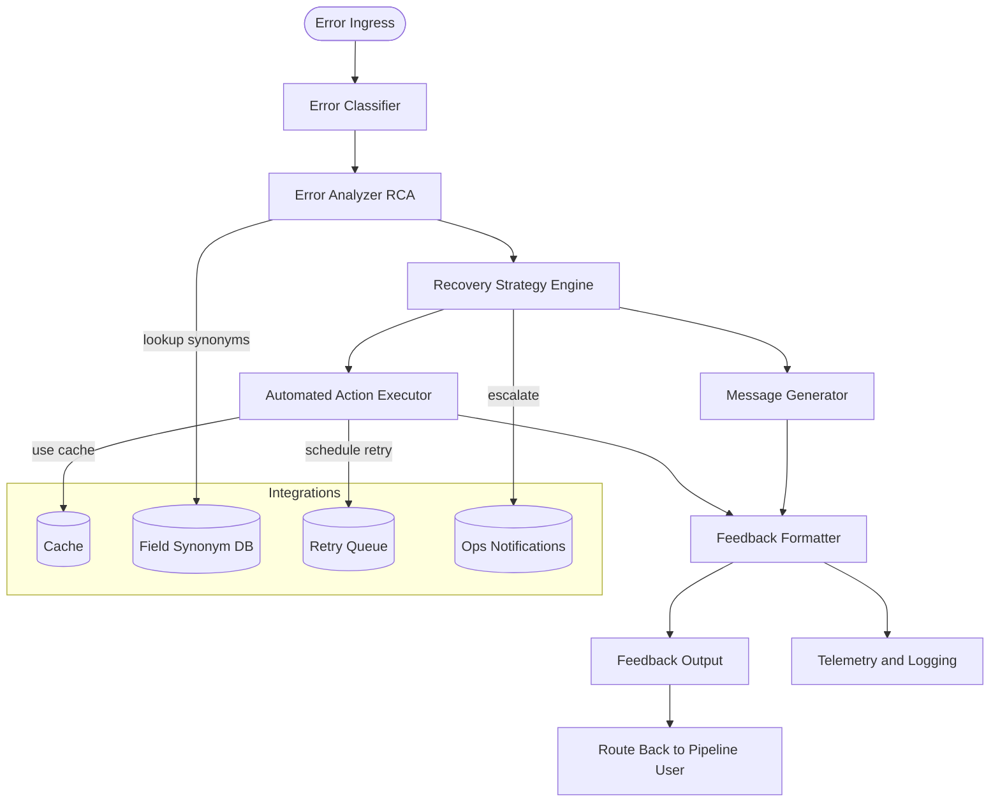

# Error Handler Agent

## Problem Statement

Pipeline agents (Input Parser, Intent Resolver, Query Engine, Visualization Agent, Context Manager) occasionally fail — ambiguous user input, missing schema fields, query timeouts, incompatible charts, or system outages. Without a centralized recovery layer, these errors cause poor user experience, lost context, repeated failures, and extra operator overhead.

The Error Handler Agent centralizes error classification, root-cause analysis, recovery orchestration, and user-facing feedback so the Natural Language → Visualization pipeline degrades gracefully and resumes reliably.

## Agent Objective

- Classify incoming errors from any pipeline agent into canonical types.
- Diagnose root causes (missing field, transient DB issue, incompatible chart, etc.).
- Decide and execute a recovery strategy (auto-fix, retry, fallback, or ask-for-clarification).
- Generate concise, actionable user messages with suggested next steps.
- Preserve and return session context so the pipeline can resume without losing state.
- Emit telemetry for monitoring and post-mortem analysis.

## Scope of Agent

### The Agent WILL:

- Accept error payloads from any pipeline agent and normalize them.
- Map raw errors into canonical error types (input_error, schema_error, query_error, chart_error, system_error, validation_error).
- Run lightweight Root Cause Analysis (RCA).
- Execute recovery policies: retries (with backoff), cached fallback, synonym mapping, suggested alternate charts, or ask-for-clarification prompts.
- Produce a structured feedback object containing user_message, recovery_suggestions, automated_actions, and preserved context.
- Return a next_action flag (resume, await_user, escalate) to drive pipeline behavior.
- Emit telemetry metrics and structured logs (error_id, severity, actions_taken).
- Be idempotent for identical errors to avoid repeated side-effects.

### The Agent WILL NOT:

- Make irreversible changes to CRM/data stores.
- Send alerts to end users outside the pipeline UI (unless integrated by ops).
- Perform heavy ML inference requiring large models (rule-first; optional small classifier for noisy cases).
- Replace human ops for complex escalations — it will escalate.
- Purge session context unless explicitly required for safety.

## Fully Dynamic Execution Path

The Error Handler is invoked when another agent emits an error; its pathway depends on incoming error type and confidence of auto-recovery.

### Example Scenarios:

| Error Scenario (Incoming) | Dynamic Execution Path |
|---------------------------|------------------------|
| Input ambiguous: "Show revenue" | InputParser ➡ ErrorHandler (input_error) ➡ suggest clarifying prompts ➡ next_action: await_user |
| Schema missing field: product_id not found | QueryEngine ➡ ErrorHandler (schema_error) ➡ list available fields + map synonyms ➡ next_action: resume (if fixed) |
| DB timeout during large aggregation | QueryEngine ➡ ErrorHandler (query_error) ➡ retry ➡ fallback to cache / reduce date range ➡ next_action: resume |
| Chart incompatible (pie for time series) | VisualizationAgent ➡ ErrorHandler (chart_error) ➡ suggest alternate chart + offer conversion ➡ next_action: resume |
| Downstream service outage | AnyAgent ➡ ErrorHandler (system_error) ➡ escalate + user message "temporarily unavailable" ➡ next_action: escalate |

Nodes not relevant to a given error type are skipped dynamically at runtime, keeping recovery focused and efficient.

## LangGraph Architecture



### States

| State Name | Purpose |
|------------|---------|
| ErrorContext | Raw error payload + originating agent + timestamps |
| RCAContext | Analysis results: probable root cause, confidence, related logs |
| RecoveryContext | Chosen strategy, automated actions, retry counters |
| SessionContext | Preserved user/session context for resuming pipeline |
| TelemetryContext | Metrics and logs for monitoring and post-mortem |

### Nodes

| Node Name | Functionality |
|-----------|---------------|
| Error Ingress | Receives error JSON from agents / message bus. |
| Error Classifier | Normalizes and maps to canonical error type with confidence score. |
| Error Analyzer (RCA) | Inspects payload + session context + logs to determine root cause. |
| Recovery Strategy Engine | Decides on action: retry, fallback, auto-fix, user prompt, or escalate. |
| Automated Action Executor | Runs safe automated actions (retry, limit scope, use cached data). |
| Message Generator | Crafts user-friendly message + machine-readable recovery hints. |
| Feedback Formatter | Assembles final structured feedback object and attaches preserved context. |
| Telemetry & Logging | Emits metrics, structured logs, and trace links for observability. |

## Tools Required

| Tool Name | Purpose |
|-----------|---------|
| ErrorClassifier | Rule-based + optional small classifier to canonicalize errors |
| RCAEngine | Rapid root-cause heuristics that use payload + recent session logs |
| RecoveryPolicyEngine | Policy rules (if/then) selecting recovery steps |
| AutomatedActionExecutor | Retry orchestration, cache fallback, safe field mapping |
| MessageFormatter | Templates for concise user messages and suggestions |
| TelemetryService | Metrics, structured logs, traces (error_id  ↔ query_id) |
| Synonym/Schema Store | Field synonyms and schema inventory for safe auto-mapping |

## Core Analytics Functions

### Error Classification
Map raw agent error to canonical types + confidence.

**Example:** DB_TIMEOUT → query_error (confidence 0.97).

### Root Cause Analysis (RCA)
Inspect stack traces + payload to infer cause.

**Heuristics:** timeouts with heavy aggregations → scale/backoff suggestions.

### Recovery Decisioning
Rule-first policy engine: prefer non-destructive retries and suggestions.

Conservative auto-fixes only when high-confidence mapping exists.

### Automated Recovery Actions
- Retry with exponential backoff (configurable attempts).
- Fall back to cache or reduced query scope (shorter date range, LIMIT).
- Suggest alternate chart types or field names.
- Ask clarifying question preserving prior context.

## Output (Hand-off to Pipeline / User)

The Error Handler returns a structured feedback object the pipeline or UI can consume:

```json
{
  "error_id": "err_20250808_0001",
  "error_type": "query_error",
  "error_source": "query_engine",
  "severity": "medium",
  "confidence": 0.92,
  "user_message": "I couldn't retrieve the full sales data right now (database timeout). Try: 'show sales by month for last 12 months' or I can show cached results.",
  "recovery_suggestions": ["Retry now", "Use cached - last 30 days", "Narrow the date range"],
  "automated_actions": ["retry:2", "use_cache:true"],
  "context_preserved": true,
  "query_id": "q_456",
  "timestamp": "2025-08-08T12:20:05Z",
  "next_action": "resume"
}
```

### Field notes
- **user_message:** human-facing, short and actionable.
- **recovery_suggestions:** explicit choices shown to user/UI.
- **automated_actions:** what the agent will or did run (for observability).
- **next_action:** instructs pipeline how to proceed (resume, await_user, escalate).

## Integration 

### Standard Error Input Format

The Error Handler Agent expects a standardized error payload from any pipeline agent:

```json
{
  "agent_id": "string",
  "timestamp": "ISO 8601 datetime",
  "status": "error",
  "data": {
    "error_type": "input_error|schema_error|query_error|chart_error|system_error|validation_error",
    "error_code": "string",
    "message": "string",
    "context": {},
    "query_id": "string"
  }
}
```


### Core Field Descriptions

| Field | Description | Example |
|-------|-------------|---------|
| **agent_id** | Which pipeline agent encountered the error | `"visualization_agent"` |
| **timestamp** | Exact time when error occurred (ISO 8601 format) | `"2025-08-08T12:01:00Z"` |
| **status** | Always "error" to identify this as an error payload | `"error"` |
| **error_type** | High-level category of what went wrong | `"chart_error"` |
| **error_code** | Specific error identifier for this exact problem | `"INCOMPATIBLE_CHART_TYPE"` |
| **message** | Human-readable explanation of what happened | `"Pie chart cannot display time-series data"` |
| **context** | Relevant details specific to this error | `{"chart": "pie", "dimension": "date"}` |
| **query_id** | Unique identifier for this specific query/request | `"q_789"` |


### Input Validation Requirements

The Error Handler Agent should validate incoming error payloads:

1. **Structure Validation**: Ensure required fields are present
2. **Type Validation**: Verify field types match expected formats
3. **Content Validation**: Check that error_type maps to known categories
4. **Query Validation**: Verify query_id exist and are valid

### Error Ingress Mechanisms

The Error Handler can receive input through **HTTP API**.

Each mechanism should normalize the input to the standard format above.

### Expected Handler Response
```json
{
  "error_id": "err_20250808_0101",
  "error_type": "chart_error",
  "error_source": "visualization_agent",
  "severity": "low",
  "user_message": "Pie charts work best for categorical data. For monthly revenue, try: 'line chart of revenue by month'. Should I convert it to a line chart?",
  "recovery_suggestions": ["Convert to line chart", "Choose a categorical dimension (product)"],
  "automated_actions": ["suggest_conversion:line"],
  "context_preserved": true,
  "next_action": "await_user"
}
```
