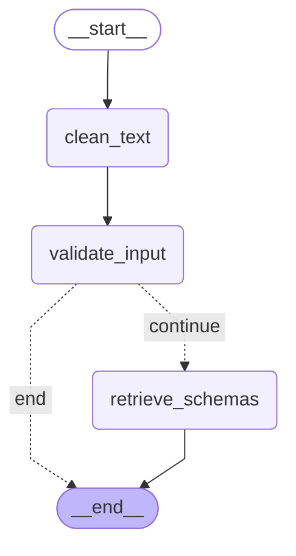

# Input Parser Agent - Simplified & LLM-Enhanced

## 🌟 Problem Statement

Natural language user inputs in data visualization systems are often messy, ambiguous, and contain typos and filler words. Users express requests using colloquial terms that need to be cleaned and validated before downstream processing. Without proper text cleaning and validation, downstream agents cannot reliably interpret user intent or generate meaningful visualizations.

This AI Agent transforms raw natural language input into clean, validated text with database schema context, enabling precise interpretation by the Intent Resolver Agent.

---

## 💡 Agent Objective

* **LLM-Powered Text Cleaning** - Fix typos and remove unnecessary words using intelligent AI processing.
* **Input Validation** - Determine if cleaned input contains actionable visualization intent.
* **Complete Schema Discovery** - Retrieve all database schema information for downstream processing.
* **Produce Clean Output** - Provide validated, clean text with full database context for Intent Resolver.

---

## 📂 Scope of Agent

### ✅ The Agent DOES:

1. **LLM-Enhanced Text Cleaning** - Intelligent typo correction and filler word removal preserving visualization intent.
2. **Input Validation** - AI-powered detection of actionable visualization requests with confidence scoring.
3. **Complete Schema Retrieval** - Load all database table and column metadata for downstream agents.
4. **Structured Output** - Clean, validated text with complete database schema context.
5. **Error Handling** - Graceful handling of LLM failures and database connection issues.

### ❌ The Agent DOES NOT:

* Generate visualization suggestions or chart recommendations (Intent Resolver's job).
* Perform field mapping or intent enhancement (Intent Resolver's job).
* Generate SQL queries or database operations.
* Create visualizations or charts directly.
* Handle user authentication or complex data analysis.
* Filter schemas based on relevance (provides all schemas to Intent Resolver).

---

## ⚙️ LangGraph Architecture



### Simplified State

| State Name              | Purpose                                                    |
| ----------------------- | ---------------------------------------------------------- |
| `InputParserState`      | Minimal TypedDict with essential fields only              |
| `raw_input`             | Original user input string                                 |
| `cleaned_input`         | LLM-cleaned text with typos fixed and filler words removed |
| `is_valid`              | Boolean indicating if input is actionable for visualization |
| `schema_context`        | Complete database schemas dictionary for Intent Resolver   |

---

### Nodes

| Node Name                 | Functionality                                                          |
| ------------------------- | ---------------------------------------------------------------------- |
| **clean_text_node**       | LLM-powered text cleaning with intelligent typo correction            |
| **validate_input_node**   | LLM validation with structured output to determine actionability      |
| **retrieve_schemas_node** | Complete database schema retrieval (all tables) for Intent Resolver   |

---

## 🛠️ Tools Required

| Tool Name               | Purpose                                                                    |
| ----------------------- | -------------------------------------------------------------------------- |
| **clean_text**          | LangChain tool using LLM for intelligent text cleaning                   |
| **validate_input**      | LangChain tool with structured output for input validation               |
| **retrieve_database_schema** | LangChain tool for complete database schema retrieval            |

---

## 📊 Core Processing Functions

### LLM-Powered Text Cleaning

* **Intelligent Typo Correction**: Context-aware spelling fixes (revinue → revenue, custmer → customer)
* **Smart Filler Removal**: Remove "can you", "please", "maybe" while preserving visualization intent
* **Business Term Preservation**: Keep all data terms, chart types, time periods, and metrics
* **Natural Language Understanding**: Context-aware cleaning that understands visualization requests

### Input Validation Logic

* **Structured LLM Output**: Pydantic model-based validation with confidence scoring
* **Intent Detection**: Classify as valid visualization request or general conversation
* **Business Context Awareness**: Understand dashboard-specific terminology and requests
* **Confidence Scoring**: AI-provided confidence scores for downstream decision making

### Complete Schema Discovery

* **All-Table Retrieval**: Provide complete database schema to Intent Resolver for field mapping
* **Relationship Mapping**: Include foreign key relationships between tables
* **Data Type Information**: Complete column metadata with data types
* **Zero Filtering**: Let Intent Resolver handle schema relevance and field mapping

---

## 🧑‍💼 Agent Persona & Tone

| Attribute                | Description                                                               |
| ------------------------ | ------------------------------------------------------------------------- |
| **Persona**              | Intelligent Text Processor, expert in cleaning visualization requests    |
| **Tone**                 | Efficient, accurate, focused on clean output                            |
| **Processing Style**     | AI-enhanced pipeline with fallback handling                             |
| **Quality Assurance**    | High-confidence LLM processing with graceful error handling             |

### Processing Examples

* **Intelligent Cleaning:**
  > *"Input: 'can you plese show me the revinue trends for q1 please' → Cleaned: 'Show revenue trends for Q1'"*

* **Typo Correction:**
  > *"Input: 'custmer performnce data' → Cleaned: 'Customer performance data'"*

* **Non-Business Detection:**
  > *"Input: 'hello how are you today' → Cleaned: 'doing today' → Valid: False"*

---

## 📊 Input/Output Specifications

### Input Schema
```json
{
  "raw_input": "string - Original user query"
}
```

### Output Schema
```json
{
  "cleaned_input": "string - LLM-cleaned text with typos fixed",
  "is_valid": "boolean - Whether input is actionable for visualization",
  "schema_context": {
    "table_name": {
      "table_name": "string",
      "columns": ["array of column names"],
      "relationships": ["array of foreign key relationships"],
      "data_types": {"column": "data_type"}
    }
  }
}
```