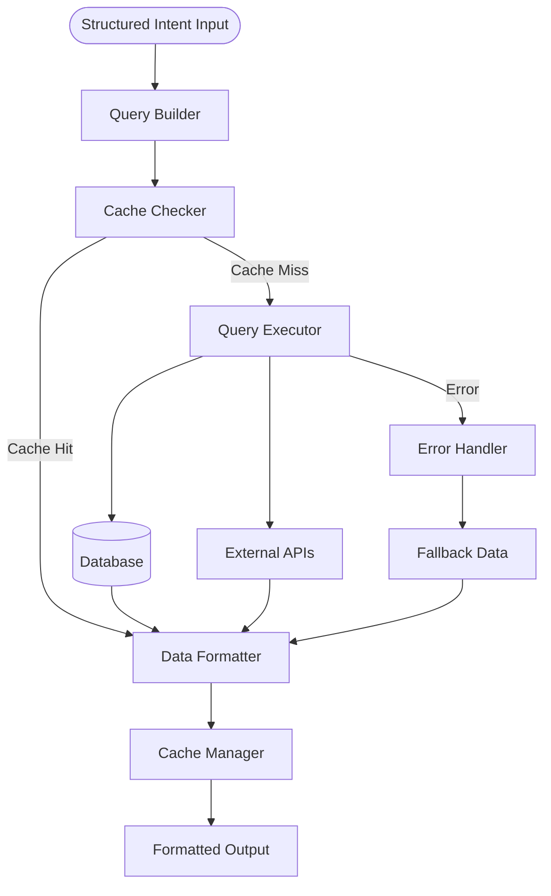

# Query Engine Agent

## 🌟 Problem Statement

Natural language visualization systems require seamless data retrieval from multiple sources (databases, APIs, cache) to populate dashboard widgets. Without proper query orchestration, users experience slow loading times, inconsistent data formats, and poor error handling when charts fail to load.

The Query Engine Agent transforms structured visualization intents into optimized, executable queries while ensuring consistent data formatting and reliable performance across all dashboard widgets.

---

## 💡 Agent Objective

- Transform structured intents into executable SQL queries and API calls
- Execute queries with optimal performance and error handling
- Format raw data into consistent widget-ready structures
- Implement intelligent caching to improve dashboard responsiveness
- Provide meaningful error feedback when data retrieval fails

---

## 📂 Scope of Agent

### ✅ The Agent WILL:

1. **Query Construction** - Build SQL queries from structured visualization intents
2. **Multi-Source Execution** - Query databases, APIs, and cached data
3. **Data Formatting** - Transform raw results into widget-compatible format
4. **Performance Optimization** - Apply caching and query optimization strategies
5. **Error Handling** - Manage query failures with fallback mechanisms
6. **Cache Management** - Store and retrieve frequently requested data
7. **Metadata Tracking** - Provide execution metrics and data source information

### ❌ The Agent WILL NOT:

- Parse natural language or resolve user intent
- Generate chart specifications or UI components
- Modify database schemas or perform data migrations
- Handle user authentication or access control
- Store sensitive data beyond session scope

---

## ⚙️ LangGraph Architecture



---

### States

| State Name | Purpose |
|------------|---------|
| `QueryIntent` | Structured intent from Intent Resolver Agent |
| `QueryPlan` | Execution strategy and data source selection |
| `QueryResults` | Raw data from database or API execution |
| `FormattedData` | Widget-ready data with metadata |

---

### Nodes

| Node Name | Functionality |
|-----------|---------------|
| **Query Builder** | Constructs SQL queries and API requests from structured intent |
| **Cache Checker** | Checks for existing cached results to avoid redundant queries |
| **Query Executor** | Executes queries against databases and external APIs |
| **Data Formatter** | Transforms raw results into consistent widget format |
| **Cache Manager** | Stores results and manages cache TTL and invalidation |
| **Error Handler** | Handles query failures and provides fallback responses |

---

## 🛠️ Tools Required

| Tool Name | Purpose |
|-----------|---------|
| `SQLBuilder` | Constructs SQL queries from visualization intents |
| `DatabaseClient` | Executes queries against SQL databases |
| `APIClient` | Makes HTTP requests to external data sources |
| `CacheClient` | Manages Redis cache operations |
| `DataValidator` | Validates and sanitizes query results |

---

## 📊 Core Analytics Functions

### Query Building Logic
- Map chart types to appropriate SQL aggregations
- Apply filters and grouping based on dimensions
- Optimize queries with LIMIT clauses and indexing hints

### Caching Strategy
- Cache frequently requested query results
- Implement TTL based on data volatility
- Cache invalidation for real-time data requirements

### Data Transformation
- Standardize field names and data types
- Handle null values and missing data
- Format data for specific widget requirements

---

## 🧑‍💼 Agent Persona & Tone

| Attribute | Description |
|-----------|-------------|
| **Persona** | Efficient data orchestrator focused on performance and reliability |
| **Tone** | Technical, performance-oriented, clear diagnostic information |
| **Focus** | Optimizing query execution and ensuring data consistency |

### Tone Examples

- **Performance Update**: "Query executed in 45ms with cache miss - storing result for future requests"
- **Error Handling**: "Database connection failed - returning cached data from 2 hours ago"
- **Optimization**: "Applied query optimization - reduced execution time by 60%"

---

## 📏 Input Format
Receives structured intent from Intent Resolver Agent:
```json
{
  "chart": "bar",
  "metric": "revenue",
  "dimension": "department",
  "table": "sales"
}
```

## 📏 Output Format
Returns formatted data to Visualization Agent:
```json
{
  "data": [
    {"department": "Engineering", "revenue": 125000},
    {"department": "Sales", "revenue": 98000}
  ],
  "metadata": {
    "total_records": 156,
    "execution_time": "45ms",
    "cache_hit": false,
    "data_source": "sales_database"
  }
}
```

---

## 🚀 Implementation Plan

### Phase 1: Core Functionality
- [ ] Basic SQL query construction
- [ ] Database connection and execution
- [ ] Simple data formatting
- [ ] Error handling for common failures

### Phase 2: Performance Features
- [ ] Redis cache integration
- [ ] Query optimization strategies
- [ ] Performance monitoring
- [ ] Advanced error recovery

### Phase 3: Enhanced Capabilities
- [ ] API data source support
- [ ] Real-time data integration
- [ ] Advanced caching strategies
- [ ] Multi-source query merging