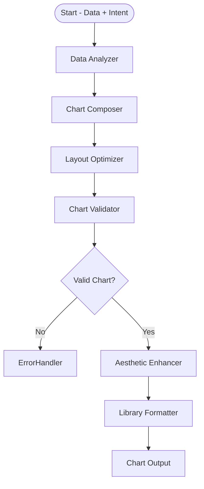

# Visualization Agent

##  Problem Statement

Business users frequently request visualizations using natural language queries (e.g., "Show me sales by month"), but converting that intent into a valid and insightful chart requires multiple translation steps. Errors in chart selection, data-field matching, or aesthetic configuration often lead to poor user experience and insight loss.

The Visualization Agent automates this process by converting structured intent and raw data into fully-validated, aesthetically-enhanced, and library-compatible chart specifications.

---

##  Agent Objective

- Analyze data properties (e.g., cardinality, data types, volume).
- Match intent with the correct chart type and field bindings.
- Validate chart-data compatibility based on visualization rules.
- Enhance chart layout and styling (tooltips, font sizes, color).
- Format the output into a ready-to-render specification for front-end libraries.

---

##  Scope of Agent

###  The Agent WILL:
- Accept chart intent (chart type, metric, dimension) and structured data.
- Suggest encoding configurations (x/y bindings, tooltip).
- Apply layout constraints (responsive size, padding, axis labels).
- Validate if chart type is compatible with data format and volume.
- Enhance visual aesthetics (tooltip, color, labels, axis).
- Output ready-to-render JSON for Vega-Lite or Plotly.

###  The Agent WILL NOT:
- Query or modify source databases.
- Guess missing fields or infer intent.
- Store historical context or user preferences.
- Display or render charts (handled externally).
- Handle multi-panel dashboards or interactivity logic.

---

##  Fully Dynamic Execution Path

The Visualization Agent dynamically decides which transformation and validation steps to apply depending on data characteristics and chart intent.

### Example Scenarios:

| User Query Description                      | Execution Path                                                                 |
|---------------------------------------------|--------------------------------------------------------------------------------|
| "Show revenue by month"                     | DataAnalyzer ➡ ChartComposer ➡ Validator ➡ AestheticEnhancer ➡ LibraryFormatter |
| "Pie chart of top products"                 | DataAnalyzer ➡ ChartComposer ➡ Validator ➡ AestheticEnhancer ➡ LibraryFormatter |
| "Bar chart of weekly logins"                | DataAnalyzer ➡ ChartComposer ➡ Validator ➡ AestheticEnhancer ➡ LibraryFormatter |
| "create pie chart of orders"                | DataAnalyzer ➡ ChartComposer ➡ Validator ✖(if metric is numeric) ➡ ErrorHandler  |

---

##  LangGraph Architecture



---

###  States

| State Name         | Description                                                              |
|--------------------|--------------------------------------------------------------------------|
| `DataContext`      | Raw dataset with inferred metadata                                       |
| `ChartIntent`      | User-defined or inferred intent (chart type, metric, dimension)          |
| `ChartDraft`       | Preliminary configuration (mark type, encodings)                         |
| `FinalChartSpec`   | Fully rendered JSON specification for output (Vega-Lite or Plotly)       |

---

###  Nodes

| Node Name            | Functionality                                                                |
|----------------------|------------------------------------------------------------------------------|
| **DataAnalyzer**     | Inspects dataset structure (fields, types, nulls, volume).                   |
| **ChartComposer**    | Constructs encoding config: x/y axes, color, tooltip, etc.                   |
| **LayoutOptimizer**  | Applies padding, sizing, and axis formatting.                                |
| **ChartValidator**   | Ensures the chart type and data are structurally compatible.                 |
| **AestheticEnhancer**| Adds visual polish (tooltip, color themes, font sizes).                      |
| **LibraryFormatter** | Finalizes output as Vega-Lite or Plotly specification.                       |
| **ErrorHandler**     | Returns descriptive error messages on validation failure.                    |

---

##  Tools Required

| Tool Name             | Purpose                                                       |
|-----------------------|---------------------------------------------------------------|
| `PlotlyFormatter`   | Formats config as JSON spec for Plotly                     |
| `VegaLiteFormatter`     | Optional support for interactive charts                       |
| `DataInspector`       | Utility for data profiling (types, nulls, record count)       |
| `EncodingMapper`      | Maps intent to chart encodings (e.g., metric ➝ y-axis)        |
| `ValidationEngine`    | Ensures field-type-to-chart compatibility                     |

---

##  Core Logic (Analytics Functions)

### Data Profiling (via `DataAnalyzer`)
- Determines field types: categorical, ordinal, quantitative
- Measures cardinality, nulls, and distribution
- Example:
  - `month`: ordinal, 12 unique values
  - `revenue`: quantitative, no nulls

### Chart Composition (via `ChartComposer`)
- Chooses base chart structure (line, bar, pie, etc.)
- Maps fields to `x`, `y`, `color`, `tooltip` encodings
- Example Mapping:
  - Intent: `line`, Metric: `revenue`, Dimension: `month`
  - Encoding: `x=month`, `y=revenue`, `tooltip=[month, revenue]`

### Layout Optimization (via `LayoutOptimizer`)
- Applies padding, axis label rotation, height/width
- Ensures readability on varying screen sizes

### Chart Validation (via `ChartValidator`)
- Ensures the field types match chart rules:
  - e.g., No pie chart for numeric-only fields
  - Minimum categories for bar/line (at least 2)

### Aesthetic Enhancements (via `AestheticEnhancer`)
- Adds color palette, font sizing, legend position
- Tooltips: multiple fields + readable formatting
- Axis formatting: titles, gridlines, tick marks

### Output Formatting (via `LibraryFormatter`)
- Generates chart config in JSON for libraries:
  - `plotly` (default)
  - `vega-lite` (optional)

---

##  Agent Persona & Tone

| Attribute         | Description                                                         |
|------------------|---------------------------------------------------------------------|
| **Persona**       | Visualization-focused assistant with deep knowledge of charting.   |
| **Tone**          | Clear, visual, and compatibility-driven.                           |
| **Clarity Focus** | All charts are optimized for readability, layout, and precision.   |
| **Fallback Skill**| Provides suggestions if chart creation fails.                      |


##  Tone Examples (User Interaction Persona)

| Tone Type      | Example Prompt                                                      |
|----------------|----------------------------------------------------------------------|
|  **Clarified Output** | “Here’s a line chart showing monthly revenue trends.”             |
|  **Suggestion**       | “Bar chart might suit better—line charts work best with time data.” |
|  **Fallback**         | “Cannot plot pie chart with numeric-only fields. Try bar chart.”     |

The agent maintains a helpful, visually aware persona focused on user understanding of the chart type, readability, and aesthetics.

---
---

##  Output

### ✅ Success Output Format (To Context Manager Agent)
```json
{
  "status": "success",
  "library": "plotly",
  "chart_spec": {
    "mark": "line",
    "encoding": {
      "x": { "field": "month", "type": "ordinal" },
      "y": { "field": "revenue", "type": "quantitative" },
      "tooltip": [{ "field": "month" }, { "field": "revenue" }]
    },
    "data": {
      "values": [
        { "month": "Jan", "revenue": 15000 },
        { "month": "Feb", "revenue": 18000 }
      ]
    }
  },
  "chart_metadata": {
    "intent_type": "trend",
    "metric": "revenue",
    "dimension": "month"
  }
}
```

---

### ❌ Error Output Format (To Error Handler Agent)
```json
{
  "status": "error",
  "reason": "Invalid chart type for numeric-only data",
  "suggestion": "Try a bar chart or add a categorical dimension",
  "input_passed": {
    "chart": "pie",
    "metric": "revenue"
  }
}
```
