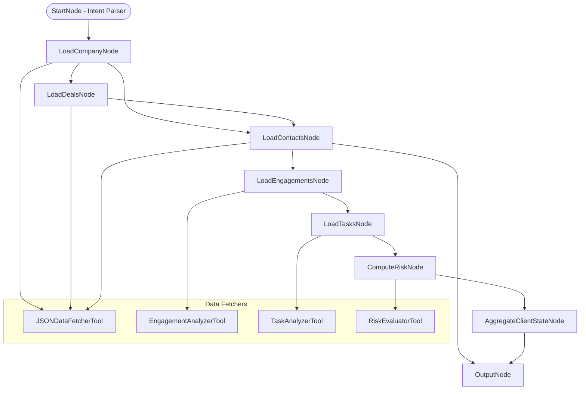

# Example

# Client Relationship Agent

## 🌟 Problem Statement

Wealth advisors and enterprise sales teams frequently lose high-value clients due to unmonitored relationship deterioration. Manual tracking of client engagements, deal progress, and communication gaps results in missed revenue opportunities, delayed risk detection, and inconsistent client management.

This AI Agent will continuously monitor client relationship health and deliver contextual insights to advisors, enabling proactive interventions before risks escalate.

---

## 💡 Agent Objective

* Maintain on-demand relationship context for each client (from latest data snapshot).
* Detect early signs of churn risk and stalled deals.
* Surface engagement opportunities based on behavior patterns.
* Deliver actionable insights to advisors within their daily workflows.

---

## 📂 Scope of Agent

### ✅ The Agent WILL:

1. Maintain **Client Relationship Health State (0-100 Scoring)**.
2. Analyze **Deal Progress Velocity** and detect stagnation.
3. Track **Engagement Patterns** (email, call, meeting recency).
4. Detect **Churn Risk Signals** (inactivity, stagnation, competitor mentions).
5. Identify **Engagement Opportunities** (high interaction, low deal activity).
6. Highlight **Communication Gaps** (overdue tasks, missing follow-ups).
7. Aggregate all data into a **Client Relationship Context Object**.
8. Pass structured data to the **Response Synthesizer Agent**.
9. Operate on **static JSON data files (mock HubSpot data)** for prototyping.

### ❌ The Agent WILL NOT:

* Send direct client communications (emails, calls).
* Modify or create deals/tasks in CRM.
* Perform financial planning or portfolio recommendations.
* Predict exact deal closure timelines.
* Analyze advisor performance across clients.
* Use live HubSpot API calls (JSON files only).
* Handle compliance, regulatory analysis.

---

## 📈 Fully Dynamic Execution Path

The agent's execution path dynamically adjusts at runtime based on the **user's query intent**. The **StartNode (Intent Parser)** determines which nodes to activate or skip. The graph remains fully connected, but the traversal "short-circuits" irrelevant paths as per the query.

### Example Scenarios:

| User Query                                                | Dynamic Execution Path                                                                                                                                         |
| --------------------------------------------------------- | -------------------------------------------------------------------------------------------------------------------------------------------------------------- |
| "Analyze the entire client relationship for ABC Corp"     | StartNode ➡ LoadCompanyNode ➡ LoadDealsNode ➡ LoadContactsNode ➡ LoadEngagementsNode ➡ LoadTasksNode ➡ ComputeRiskNode ➡ AggregateClientStateNode ➡ OutputNode |
| "Evaluate the risk of losing ABC Corp"                    | StartNode ➡ LoadCompanyNode ➡ LoadDealsNode ➡ LoadEngagementsNode ➡ LoadTasksNode ➡ ComputeRiskNode ➡ OutputNode                                               |
| "Show me overdue tasks for XYZ Ltd"                       | StartNode ➡ LoadCompanyNode ➡ LoadTasksNode ➡ OutputNode                                                                                                       |
| "Who are the major people that need to be kept track of?" | StartNode ➡ LoadCompanyNode ➡ LoadContactsNode ➡ OutputNode                                                                                                    |

Nodes that are not relevant to a given query are **skipped dynamically at runtime**, ensuring the workflow is fully query-driven and efficient.

---

## ⚙️ LangGraph Architecture



### States

| State Name          | Purpose                                                |
| ------------------- | ------------------------------------------------------ |
| `CompanyContext`    | Stores company-level data (name, ID, industry, tier).  |
| `DealContext`       | Active deals, stages, values, time-in-stage.           |
| `ContactContext`    | Key contacts, engagement scores, last interaction.     |
| `EngagementContext` | Timeline of emails, calls, meetings, tasks.            |
| `TaskContext`       | Open tasks and follow-ups.                             |
| `RiskContext`       | Flags for relationship risks (stagnation, inactivity). |

---

### Nodes

| Node Name                    | Functionality                                                                 |
| ---------------------------- | ----------------------------------------------------------------------------- |
| **StartNode**                | Parses query intent and dynamically determines path.                          |
| **LoadCompanyNode**          | Loads company JSON data.                                                      |
| **LoadDealsNode**            | Loads associated deals JSON.                                                  |
| **LoadContactsNode**         | Loads associated contacts JSON.                                               |
| **LoadEngagementsNode**      | Loads activities JSON (emails, calls, meetings).                              |
| **LoadTasksNode**            | Loads pending tasks JSON.                                                     |
| **ComputeRiskNode**          | Business logic for churn risks, communication gaps, stalled deals.            |
| **AggregateClientStateNode** | Assembles complete context into a structured summary object.                  |
| **OutputNode**               | Passes final context object to the **Response Synthesizer Agent** (external). |

---

## 🛠️ Tools Required

| Tool Name                  | Purpose                                                                   |
| -------------------------- | ------------------------------------------------------------------------- |
| **JSONDataFetcherTool**    | Reads specific JSON files for Companies, Deals, Contacts, etc.            |
| **EngagementAnalyzerTool** | Processes activity JSON to determine last engagement, frequency patterns. |
| **TaskAnalyzerTool**       | Identifies pending tasks and overdue follow-ups.                          |
| **RiskEvaluatorTool**      | Computes churn risks based on engagement gaps, stagnating deals.          |

---

## 📊 Core Analytics Functions

### Relationship Health Calculation

* Communication frequency and recency.
* Deal progression velocity.
* Engagement responsiveness.
* Historical relationship trends.

### Risk Detection Algorithms

* Detect communication inactivity.
* Identify stalled or stagnating deals.
* Flag response time degradations.
* Highlight competitor mentions (from notes).

### Opportunity Identification

* Surface high-engagement but non-deal contacts.
* Suggest cross-sell or upsell readiness.
* Recommend optimal re-engagement timing.

---

## 🧑‍💼 Agent Persona & Tone

| Attribute                | Description                                                                  |
| ------------------------ | ---------------------------------------------------------------------------- |
| **Persona**              | Analytical yet approachable CRM Specialist, expert in relationship dynamics. |
| **Tone**                 | Professional, action-oriented, data-backed recommendations.                  |
| **Contextual Awareness** | Differentiates between high-value and standard clients.                      |
| **Proactivity**          | Focuses on identifying issues before they escalate.                          |

### Tone Examples

* **Risk Alert (High Priority):**

  > *"ALERT: ABC Corp has been inactive for 14 days, with their \$50K deal stalled in Proposal Sent stage for over 20 days. Recommend immediate follow-up."*

* **Opportunity Nudge (Medium Priority):**

  > *"OPPORTUNITY: XYZ Ltd has shown high engagement this month (85% email open rate), but no active deals. Suggest initiating a discovery call."*

---

## 📏 Output (Hand-off to Response Synthesizer Agent)

The final structured context object will include:

```json
{
  "company": {...},
  "deals": [...],
  "contacts": [...],
  "engagements": [...],
  "tasks": [...],
  "risks": [...],
  "opportunities": [...],
  "summaryDraft": "Ready for synthesis by external agent"
}
```
