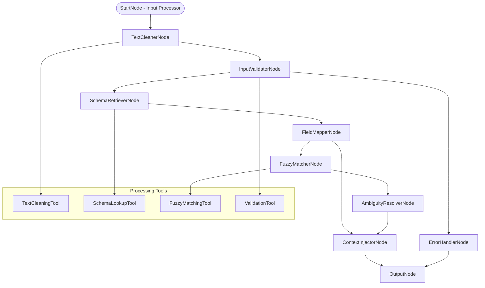

# Input Parser Agent

## 🌟 Problem Statement

Natural language user inputs in data visualization systems are often messy, ambiguous, and disconnected from actual database schemas. Users express requests using colloquial terms, contain typos, filler words, and lack precision needed for accurate data retrieval. Without proper parsing and schema grounding, downstream agents cannot reliably interpret user intent or generate meaningful visualizations.

This AI Agent will transform raw natural language input into clean, validated, and schema-enriched structured data, enabling precise interpretation and visualization generation.

---

## 💡 Agent Objective

* Clean and normalize raw user input by removing noise and filler words.
* Validate if user input contains actionable visualization intent.
* Map human terminology to actual database schema elements.
* Enrich parsed input with relevant database schema context.
* Produce structured output optimized for downstream Intent Resolver Agent.

---

## 📂 Scope of Agent

### ✅ The Agent WILL:

1. **Text Cleaning & Normalization** - Remove filler words, typos, and redundant phrases.
2. **Input Validation** - Detect actionable visualization intents in user queries.
3. **Schema Retrieval** - Load relevant database table and column metadata.
4. **Field Mapping** - Map colloquial terms to actual database field names.
5. **Context Injection** - Attach schema metadata to structured output.
6. **Fuzzy Matching** - Handle variations in terminology and spelling.
7. **Session Context** - Maintain user session and preference context.
8. **Error Handling** - Gracefully handle malformed or ambiguous inputs.

### ❌ The Agent WILL NOT:

* Generate actual SQL queries or database operations.
* Create visualizations or charts directly.
* Perform complex data analysis or calculations.
* Handle user authentication or authorization.
* Modify database schemas or structures.
* Execute downstream visualization logic.
* Store persistent user data beyond session scope.

---

## ⚙️ LangGraph Architecture



### States

| State Name              | Purpose                                                    |
| ----------------------- | ---------------------------------------------------------- |
| `RawInputContext`       | Original user input with session metadata                 |
| `CleanedInputContext`   | Processed input with noise removal and normalization      |
| `ValidationContext`     | Input validity status and confidence scores               |
| `SchemaContext`         | Relevant database tables, columns, and metadata           |
| `MappingContext`        | Field mappings between human terms and database fields    |
| `MatchingContext`       | Fuzzy matching results and confidence scores              |
| `EnrichedOutputContext` | Final structured output with all context information      |

---

### Nodes

| Node Name                 | Functionality                                                          |
| ------------------------- | ---------------------------------------------------------------------- |
| **StartNode**             | Receives raw input and initializes processing context                 |
| **TextCleanerNode**       | Removes filler words, typos, and normalizes text                      |
| **InputValidatorNode**    | Validates if input contains actionable visualization intent            |
| **SchemaRetrieverNode**   | Loads relevant database schema metadata                               |
| **FieldMapperNode**       | Maps human terms to database field names using keyword matching       |
| **FuzzyMatcherNode**      | Handles spelling variations and partial matches                       |
| **AmbiguityResolverNode** | Resolves conflicts when multiple schema matches are found             |
| **ContextInjectorNode**   | Merges all context into structured output format                      |
| **ErrorHandlerNode**      | Handles invalid or unprocessable inputs gracefully                    |
| **OutputNode**            | Formats final output for Intent Resolver Agent handoff                |

---

## 🛠️ Tools Required

| Tool Name               | Purpose                                                                    |
| ----------------------- | -------------------------------------------------------------------------- |
| **TextCleaningTool**    | NLP-based text preprocessing, noise removal, and normalization            |
| **SchemaLookupTool**    | Database schema retrieval and metadata caching                            |
| **FuzzyMatchingTool**   | String similarity matching for field name resolution                      |
| **ValidationTool**      | Intent detection and input quality assessment                             |
| **KeywordMapperTool**   | Predefined mappings between common terms and database fields              |
| **ContextMergerTool**   | JSON structure assembly and validation                                    |

---

## 📊 Core Processing Functions

### Text Cleaning Pipeline

* **Filler Word Removal**: Strip "can you", "please", "maybe", "show me"
* **Typo Correction**: Basic spell checking and correction
* **Normalization**: Convert to lowercase, standardize spacing
* **Keyword Extraction**: Identify core intent and data elements

### Schema Mapping Logic

* **Direct Matching**: Exact keyword to field name mapping
* **Fuzzy Matching**: Levenshtein distance-based similarity
* **Contextual Mapping**: Consider table relationships and context
* **Confidence Scoring**: Rate mapping accuracy for downstream validation

### Input Validation Rules

* **Intent Detection**: Presence of visualization keywords (show, display, chart)
* **Data References**: Mention of metrics, dimensions, or timeframes
* **Completeness Check**: Minimum required elements for actionable request
* **Ambiguity Detection**: Multiple possible interpretations

---

## 🧑‍💼 Agent Persona & Tone

| Attribute                | Description                                                               |
| ------------------------ | ------------------------------------------------------------------------- |
| **Persona**              | Methodical Data Linguist, expert in natural language to schema mapping   |
| **Tone**                 | Precise, systematic, focused on clarity and accuracy                      |
| **Processing Style**     | Thorough validation with graceful error handling                         |
| **Quality Assurance**    | High confidence in schema mappings, transparent about ambiguities        |

### Processing Examples

* **Clean Input (High Confidence):**
  > *"Input 'Show me sales by month' → Mapped to table: 'sales', columns: ['sale_date', 'revenue'] with 95% confidence"*

* **Ambiguous Input (Medium Confidence):**
  > *"Input 'revenue data' → Multiple tables match: ['sales', 'orders'] - flagged for disambiguation"*

* **Invalid Input (Low Confidence):**
  > *"Input 'random text' → No actionable intent detected - passed to error handler"*

---

## 📊 Input/Output Specifications

### Input Schema
```json
{
  "raw_input": "string - Original user query",
  "session_id": "string - User session identifier",
  "user_id": "string - User identifier",
  "context": {
    "previous_queries": ["array of recent queries"],
    "preferred_tables": ["array of frequently used tables"]
  }
}
```

### Output Schema
```json
{
  "cleaned_input": "string - Processed and normalized input",
  "is_valid": "boolean - Whether input is actionable",
  "confidence_score": "number - Processing confidence (0-1)",
  "detected_intent": "string - Primary visualization intent",
  "primary_table": "string - Main table identified",
  "columns": ["array of relevant column names"],
  "mapped_fields": {
    "human_term": "database_field"
  },
  "schema_context": {
    "table_name": {
      "columns": ["array of all columns"],
      "relationships": ["array of foreign keys"],
      "data_types": {"column": "type"}
    }
  },
  "processing_metadata": {
    "processing_time_ms": "number",
    "nodes_executed": ["array of executed nodes"],
    "warnings": ["array of processing warnings"]
  },
  "original_input": "string - Preserved original input"
}
```